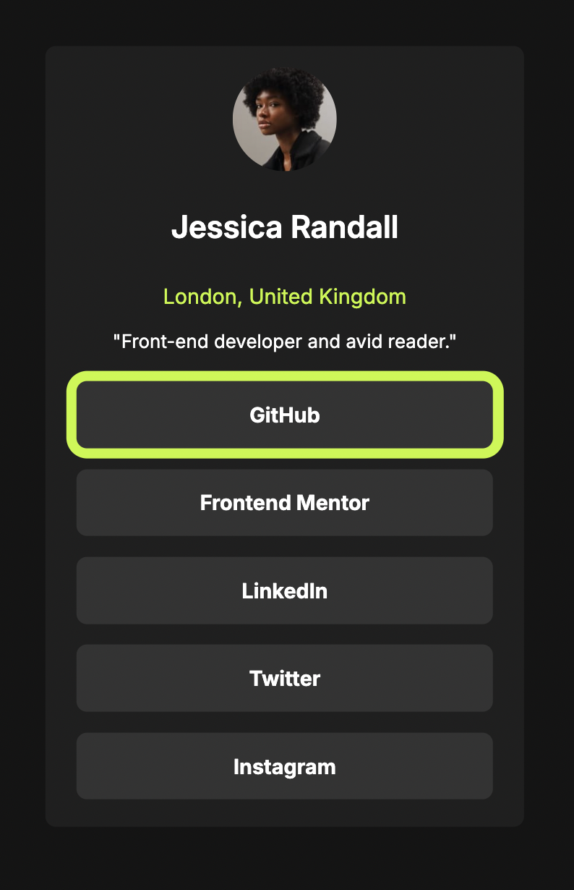
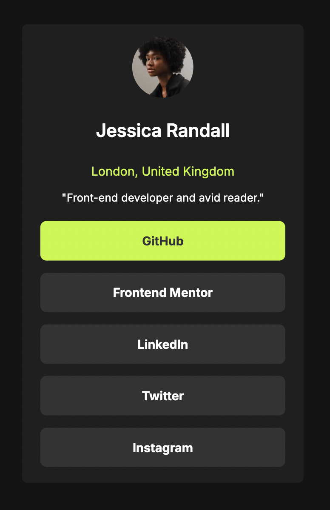

# Frontend Mentor - Social links profile solution

This is a solution to the [Social links profile challenge on Frontend Mentor](https://www.frontendmentor.io/challenges/social-links-profile-UG32l9m6dQ). Frontend Mentor challenges help you improve your coding skills by building realistic projects. 

## Table of contents

- [Overview](#overview)
  - [Screenshot](#screenshot)
  - [Links](#links)
- [My process](#my-process)
  - [Built with](#built-with)
  - [What I learned](#what-i-learned)
  - [Continued development](#continued-development)
  - [Useful resources](#useful-resources)
- [Author](#author)
- [Acknowledgments](#acknowledgments)

## Overview

### Screenshot

### Links

- Solution URL: (https://github.com/minahopgood/social-links-profile)
- Live Site URL: (https://minahopgood.github.io/social-links-profile/)

## My process

### Built with

- Semantic HTML5 markup
- Keyboard accessibility
- Flexbox

### What I learned

After my previous two challenges, I spent some time learning how to use em and rem units and I feel as though I have finally have a grasp on how to use them. I also did some research into focus states, as I wasn't sure what the difference was between :hover and :focus. I have learned how to properly customise a website to not only make it pretty, but to help with basic keyboard accessibility.

### Continued development

I will be trying to incorporate more website accessibility into my code. Early on in my web development journey I touched on this subject through freeCodeCamp, but now that I have a better grasp on the basics of HTML and CSS, I think I will have a better time understanding these concepts and how to use them.

### Useful resources

- [A Guide To Keyboard Accessibility - Smashing Magazine](https://www.smashingmagazine.com/2022/11/guide-keyboard-accessibility-html-css-part1/) - I used this website to assist with learning about focus states and keyboard accessibility. It seems to be an extremely thorough resource that I will be refering back to in the future.
- [The Difference Between em and rem units - Kevin Powell](https://www.youtube.com/watch?v=_-aDOAMmDHI) - This was recommended to me by another Frontend Mentor member to help with learning the difference between em and rem units. It was incredibly helpful and I feel like I have a much stronger grasp on how to use them.

## Author

- GitHub - [Mina Hopgood](https://github.com/minahopgood)
- Frontend Mentor - [@minahop](https://www.frontendmentor.io/profile/minahopgood)

## Acknowledgments

Other Frontend Mentor users provided me with resources and explanations on how rem and em units, which helped me tremendously! Thank you to those users, as well as the very welcoming FEM community.
